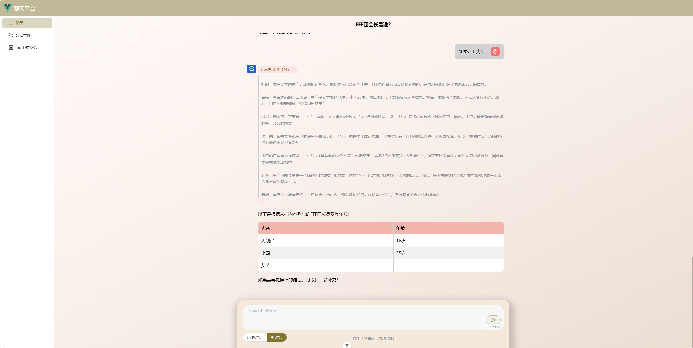
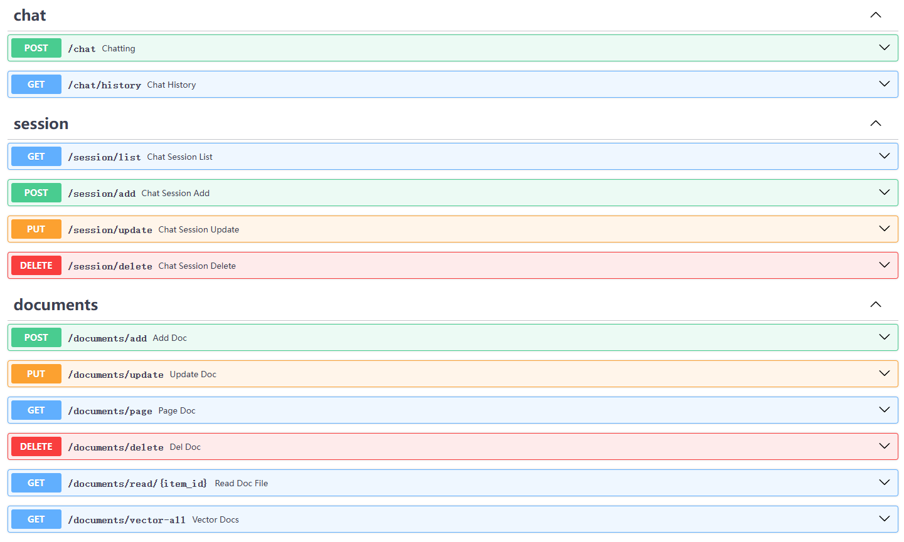

# 📃 **关于 py-doc-qa-deepseek-server**

基于  [🦜️🔗 LangChain](https://github.com/hwchase17/langchain) 与  DeepSeek R1 大语言模型的本地知识库问答。

本项目是本地知识库问答应用的 serve 后端。目前实现基本的 RAG 功能。  
后续会系统学习 langchain ，逐步添加更多的功能。

项目使用 [FastAPI](https://fastapi.tiangolo.com/zh/tutorial/sql-databases/) + [Uvicorn](https://www.uvicorn.org/) + [SQLModel](https://sqlmodel.fastapi.org.cn/) + SQLite 框架。 向量数据库使用 [Chroma](https://docs.trychroma.com/docs/overview/introduction) 。

> 为了直观的体现API交互，可搭配下面的 vue 前端框架结合使用。
>
> vue 前端 **vue-doc-qa-chat** 链接：<https://github.com/YuiGod/vue-doc-qa-chat>

## 系列文章

1.  [《从零开始DeepSeek R1搭建本地知识库问答系统》一：利用WSL2搭建Linux子系统并设置运行环境前言](https://juejin.cn/post/7470334881735196684)
2.  [《从零开始DeepSeek R1搭建本地知识库问答系统》二：Ollama 部署 DeepSeek R1 蒸馏模型及Api测试](https://juejin.cn/post/7470345587309854774)
3.  [《从零开始DeepSeek R1搭建本地知识库问答系统》三：基于LangChain构建本地知识库问答RAG应用](https://juejin.cn/post/7470807715898212406)
4.  [《从零开始DeepSeek R1搭建本地知识库问答系统》四：FastApi 框架搭建本地知识库问答Web Server端](https://juejin.cn/post/7478991058870747170)
5.  [《从零开始DeepSeek R1搭建本地知识库问答系统》五：实现问答系统前端 UI 框架，基于 vue3 + typescript + ElementPlus](https://juejin.cn/post/7480009518175567907)

## 项目使用前提

**确保已经安装 Ollama，并部署 `deepseek-r1:7b` 大语言模型**，具体操作可以观看系列文章第一章和第二章。\
也可以根据自己电脑配置更换模型。在项目地址 `app/core/base.py` 下指定模型名称。

## 快速上手

```shell
# 打开 ubuntu 终端，切换 r1 环境
conda activate r1

# 打开目录
cd Project

# 拉取项目
$ git clone https://github.com/YuiGod/py-doc-qa-deepseek-server.git

# 进去项目
$ cd py-doc-qa-deepseek-server

# 安装项目相关依赖
pip install -r requirements.txt

# 进入 app 目录
cd app

# 启动服务
python main.py
```

## 项目预览

> 因为git压缩了帧率，看起来不够流畅。可点击这里下载预览视频观看：[预览视频。](https://raw.githubusercontent.com/YuiGod/py-doc-qa-deepseek-server/refs/heads/main/images/preview.mp4)

  
  
  
  

## 项目功能

1.  文档管理API，文档上传到指定位置，并在 SQLite 记录信息。
2.  聊天对话历史管理API，用 SQLite 保存记录。
3.  聊天采用流式响应。
4.  实现基本的 RAG 功能。

> 基本框架已经搭建完成。后续会系统学习 LangGraph ，添加更多新的功能。


## src 目录树


```
    app                             # 主目录
    ├── core                        # LangChan 核心代码
    │   ├── base.py                 # LangChan 常量配置
    │   ├── langchain_retrieval.py  # 构建检索连
    │   └── langchain_vector.py     # 读取文档，分割文档，向量化文档
    ├── crud                        # 数据库 crud 操作目录
    │   ├── __init__.py
    │   ├── base.py                 # 数据库配置
    │   ├── chat_history_crud.py    # 对话聊天历史 crud
    │   ├── chat_session_crud.py    # 会话管理 crud
    │   └── document_crud.py        # 文档管理 crud
    ├── models                      # 数据库模型，基本模型目录
    │   ├── __init__.py
    │   ├── chat_history_model.py   # 聊天历史记录管理数据库模型
    │   ├── chat_model.py           # 聊天模型，基本模型
    │   ├── chat_session_model.py   # 会话管理数据库模型
    │   └── document_model.py       # 文档挂你数据库模型
    └── routers                     # api 路由分类
    │   ├── __init__.py
    │   ├── base.py                 # 基础配置，配置成功和失败返回模型
    │   ├── chat_router.py          # 聊天 Api
    │   ├── chat_session_router.py  # 会话管理 Api
    │   └── document_router.py      # 文档管理 Api
    ├── document_qa.db              # SQLite数据库
    ├── main.py                     # 主程序启动服务入口
```

## document_qa.db 表

### 1. **document 表**

```python
class Document(SQLModel, table=True):
    """document表"""

    id: uuid.UUID = Field(default_factory=uuid.uuid4, primary_key=True)
    name: str
    file_name: str = Field(index=True)
    file_path: str | None = None
    suffix: str | None = None
    vector: str | None = None
    date: datetime = Field(default_factory=datetime.now)
```

### 2. **chatsession 表**

```python
class ChatSession(SQLModel, table=True):
    """chatsession表"""

    id: uuid.UUID = Field(default_factory=uuid.uuid4, primary_key=True)
    title: str | None = None
    date: datetime = Field(default_factory=datetime.now)
```

### 3. **chathistory 表**

```python
class ChatHistory(SQLModel, table=True):
    """chathistory表"""

    id: uuid.UUID = Field(default_factory=uuid.uuid4, primary_key=True)
    role: str
    content: str
    think: str | None = None
    chat_session_id: uuid.UUID | None = None
    date: datetime = Field(default_factory=datetime.now)
```

## Api 接口



### 1. 聊天

#### `/chat`

*   请求类型：***POST***
*   Request data  请求体：

<!---->

    {
      "model": "deepseek-r1:7b", // 模型名称
      "stream": true, // 开启流式响应
      "messages": {
        "role": "user", // 角色
        "content": "FFF团会长是谁？" // 内容
      }
    }

*   Responses 响应体：JSON 对象字符串二进制流。`content-type: application/x-ndjson`

<!---->

    // json 流未完成时
    {
      "model": "deepseek-r1:7b", // 模型名称
      "created_at": 1741384731918, // 时间戳
      "message": {
        "role": "assistant", // 角色
        "content": "首先" // 内容
      },
      "done": false // 流式未完成标记
    }
    {……}
    ...

    // json 流完成时
    {
      "model": "deepseek-r1:7b", // 模型名称
      "created_at": 1741384734349, // 时间戳
      "message": {
        "role": "assistant", // 角色
        "content": "" // 内容，为空
      },
      "done": true, // 流式是已完成标记
      "done_reason": "stop" // 完成信息
    }

***

#### `/chat/history`

*   请求类型：***GET***
*   Request params 参数：

<!---->

    {
      "id": "cae1e775-31b2-44a8-b5d3-873bbabfff4c" // 必填，会话 id
      "title": "标题" // 可选，会话标题
    }

*   Responses 响应体：`application/json`

<!---->

    {
      "code": 200,
      "message": "响应成功！",
      "data": [
        {
          "id": "43339654-d5ce-4ace-ab98-399741558b32",
          "role": "user",
          "content": "FFF团会长是谁？",
          "think": null,
          "chat_session_id": "cae1e775-31b2-44a8-b5d3-873bbabfff4c", // 会话id
          "date": "2025-03-08 00:44:35"
        },
        {
          "id": "dc05a6ce-b093-47de-869a-62f9e2efcb0a",
          "role": "assistant",
          "content": "\n\n根据文档内容，FFF团的会长是大靓仔。",
          "think": "\n嗯，用户问的是“FFF团会长是谁………………",
          "chat_session_id": "cae1e775-31b2-44a8-b5d3-873bbabfff4c", // 会话id
          "date": "2025-03-08 00:44:38"
        }
      ]
    }

***

### 2.  会话管理

#### `/session/list`

*   请求类型：***GET***
*   Request params 参数：无
*   Responses 响应体：`application/json`

<!---->

    {
      "code": 200,
      "message": "响应成功！",
      "data": [
        {
          "id": "cae1e775-31b2-44a8-b5d3-873bbabfff4c",
          "title": "FFF团会长是谁？",
          "date": "2025-03-08 00:44:35"
        },
        {
          "id": "3eed0670-2c68-4b09-942a-e1b5b9a02bf8",
          "title": "小芳最喜欢的电影是什么？",
          "date": "2025-03-07 00:40:20"
        }
      ]
    }

***

#### `/session/add`

*   请求类型：***POST***
*   Request data  请求体：

<!---->

    {
      "title": "标题" // 必填，会话标题
    }

*   Responses 响应体：`application/json`

<!---->

    {
      "code": 200,
      "message": "响应成功！",
      "data": {
        "id": "cae1e775-31b2-44a8-b5d3-873bbabfff4c",
        "title": "FFF团会长是谁？",
        "date": "2025-03-08 00:44:35"
      }
    }

***

#### `/session/update`

*   请求类型：***PUT***
*   Request data 请求体：

<!---->

    {
      "id": "cae1e775-31b2-44a8-b5d3-873bbabfff4c", // 必填，会话 id
      "title": "标题" // 必填，会话标题
    }

*   Responses 响应体：`application/json`

<!---->

    {
      "code": 200,
      "message": "响应成功！",
      "data": {
        "id": "cae1e775-31b2-44a8-b5d3-873bbabfff4c",
        "title": "FFF团会长是谁？",
        "date": "2025-03-08 00:44:35"
      }
    }

***

#### `/session/delete`

*   请求类型：***DELETE***
*   Request data 请求体：

<!---->

    {
      "id": "cae1e775-31b2-44a8-b5d3-873bbabfff4c" // 必填，会话 id
    }

*   Responses 响应体：`application/json`

<!---->

    {
      "code": 200,
      "message": "响应成功！",
      "data": null
    }

\--

### 2.  文档管理

#### `/documents/page`

*   请求类型：***GET***
*   Request params 参数：

<!---->

    {
      "page_num": 1
            "page_size": 10,
      // 以下可选
      "id": "", // 文档 id
      "name": "", // 文档名称
      "file_name": "", // 文档服务器名称，uuid 一般用不到
      "file_path": "", // 文档服务器保存路径
      "suffix": "", // 文档后缀类型
      "vector": "", // 是否已经向量化
      "date": "", // 创建时间
    }

*   Responses 响应体：`application/json`

<!---->

    {
      "code": 200,
      "message": "响应成功！",
      "data": {
        "total": 1,
        "page_num": 1,
        "page_size": 10,
        "list": [
          {
            "id": "6b364b00-b7d7-408b-95f3-646ca226133f",
            "name": "FFF团",
            "file_name": "b0f5c29a-7caa-4fcf-bd10-b1bd7ec6687d.txt",
            "file_path": "/fileStorage/b0f5c29a-7caa-4fcf-bd10-b1bd7ec6687d.txt",
            "suffix": ".txt",
            "vector": "yes", // yes/no
            "date": "2025-03-08 00:44:26"
          }
        ]
      }
    }

***

#### `/documents/add`

*   请求类型：***POST***
*   Request FormData 请求体：表单数据

<!---->

    {
      "name": "FFF团", // 必填，文档名称
      "flie": "blob" // 必带，二进制文件
    }

*   Responses 响应体：`application/json`

<!---->

    {
      "code": 200,
      "message": "添加成功！",
      "data": null
    }

***

#### `/documents/update`

*   请求类型：***PUT***
*   Request FormData 请求体：表单数据

<!---->

    {
      "name": "FFF团",
      "flie": "blob" // 二进制文件
    }

*   Responses 响应体：`application/json`

<!---->

    {
      "code": 200,
      "message": "更新成功！",
      "data": null
    }

***

#### `/documents/delete`

*   请求类型：***DELETE***
*   Request data 请求体：

<!---->

    {
      "id": "6b364b00-b7d7-408b-95f3-646ca226133f" // 文档 id
    }

*   Responses 响应体：`application/json`

<!---->

    {
      "code": 200,
      "message": "删除成功！",
      "data": null
    }

***

#### `/documents/read`

*   请求类型：***GET***
*   Request data 请求体：

<!---->

    {
      "id": "6b364b00-b7d7-408b-95f3-646ca226133f" // 文档 id
    }

Responses 响应体：根据不同文件后缀，返回不同的请求头

    Blob

***

### 3. 向量化

#### `/documents/vector-all`

*   请求类型：***GET***
*   Request data 请求体：无
*   Responses 响应体：`application/json`

<!---->

    {
      "code": 200,
      "message": "删除成功！",
      "data": null
    }
